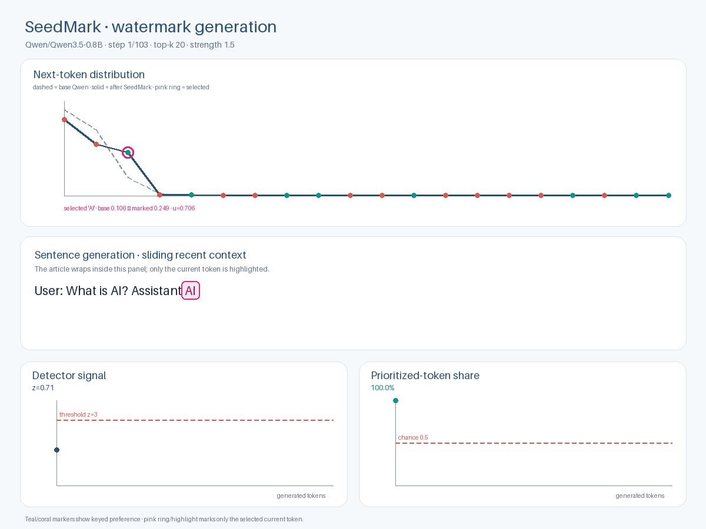

# SeedMark 🌱🔐

<p align="center">
  <strong>An inspectable research and teaching lab for token-level and semantic self-keyed LLM watermarking.</strong>
</p>

<p align="center">
  
  
  
  
</p>

SeedMark demonstrates how a language model can embed a statistically detectable
signal **during token sampling** while the detector later reconstructs the keyed
signal without receiving the generator's original next-token probability
distribution.

Version **0.7.0** contains two complementary watermark modes:

| Mode | Key context | Positioning | Main purpose |
|---|---|---|---|
| **Baseline token watermark** | first word of the user question | global token position | minimal, transparent teaching baseline |
| **Semantic self-key watermark** | evolving semantics of the answer | sentence-local token offset | robustness-oriented research mode with re-synchronisation |

The generator backend is model-agnostic at the algorithm level: a compatible
autoregressive model needs stable token IDs and access to next-token logits or
probabilities. The repository currently ships **Qwen3.5** as the reference Hugging
Face backend.

> [!IMPORTANT]
> SeedMark is a research/education prototype. It is **not** Anthropic's production
> watermark, **not** Google SynthID-Text, **not** C2PA, and does not claim that its
> watermark is impossible to remove or sufficient as standalone proof of
> authorship.

---

## What is new: semantic self-key watermarking

The original SeedMark baseline is intentionally easy to inspect, but its visible
seed and absolute token positions are fragile under editing. Semantic mode changes
the watermark state at **sentence boundaries** using the meaning of the answer
itself.

```text
User question
    │
    └──── bootstrap first assistant sentence
                         │
                         ▼
                 generated sentence
                         │
                         ▼
                 semantic encoder
                         │
                         ▼
             nearest secret semantic bucket
                         │
                         ▼
               key next sentence sampling
                         │
                         └──── repeat
```

For each candidate token in the current sentence, semantic mode computes a keyed
score from:

```text
secret key
+ semantic bucket of recent completed answer text
+ sentence-local token offset
+ candidate token ID
```

The normal model probability `p(v)` is then tilted using the same transparent rule
as the baseline:

```text
q(v) ∝ p(v) · exp(strength · (2u(v) - 1))
```

The important robustness feature is **re-synchronisation**. Token offsets reset at
each sentence boundary. An insertion or deletion can damage evidence inside one
sentence without permanently shifting every later position. If a paraphrase keeps
the previous sentence in the same coarse semantic bucket, the following sentence
can return to the same watermark state.

This design is intentionally conservative in its claims: semantic keying can make
surface edits less catastrophic, but rewriting the carrier tokens or moving text
across semantic bucket boundaries can still weaken or remove the signal.

Read the full design and threat model in
[`docs/semantic-watermark.md`](docs/semantic-watermark.md).

---

## Semantic quick start

Install the real-LLM dependencies:

```bash
python -m pip install -e ".[real-llm]"
```

Run a matched semantic marked/control experiment:

```bash
seedmark semantic-qwen-demo \
  --question "What is AI?" \
  --output-dir results/semantic-qwen
```

The command writes:

```text
results/semantic-qwen/
├── generated_watermarked.txt
├── generated_control.txt
├── watermarked-trace.json
├── control-trace.json
└── summary.json
```

The default semantic encoder is:

```text
sentence-transformers/all-MiniLM-L6-v2
```

It is loaded with Hugging Face `AutoTokenizer` + `AutoModel` and masked mean
pooling; the separate `sentence-transformers` Python package is not required.
By default, the semantic encoder runs on CPU so it does not consume the generator
GPU memory budget.

Useful semantic options:

```bash
seedmark semantic-qwen-demo \
  --question "What is edge AI?" \
  --bucket-count 32 \
  --context-sentences 1 \
  --semantic-device cpu \
  --max-new-tokens 128 \
  --output-dir results/edge-ai-semantic
```

Detect a saved semantic-watermarked answer without loading the generator model
weights:

```bash
seedmark semantic-qwen-detect \
  --question "What is AI?" \
  --text-file results/semantic-qwen/generated_watermarked.txt
```

Semantic detection still needs the generator tokenizer plus the same semantic
encoder configuration, bucket count, context-window setting, and secret key.

### Python API

```python
from seedmark.semantic_chat import SemanticChatQwenSeedMark

lab = SemanticChatQwenSeedMark(
    model_name="Qwen/Qwen3.5-0.8B",
    semantic_device="cpu",
)

marked = lab.generate(
    question="What is AI?",
    watermarked=True,
    bucket_count=32,
    context_sentences=1,
)

control = lab.generate(
    question="What is AI?",
    watermarked=False,
    bucket_count=32,
    context_sentences=1,
)

print(marked.text)
print(marked.detection)
print(control.detection)
```

---

## Semantic traceability

Semantic mode records enough information to inspect every sampling decision:

- sentence index;
- sentence-local token offset;
- semantic context used for the key;
- selected semantic bucket;
- semantic bucket stability margin;
- candidate token IDs and decoded text;
- base model probability;
- watermarked generation probability;
- keyed PRF score;
- selected token;
- cumulative detector z-score.

The **bucket margin** is particularly useful for robustness research: a small
margin means the semantic context was close to a bucket boundary and may be more
likely to change bucket after a meaning-preserving edit.

---

## Baseline SeedMark demo

The original token-level experiment remains unchanged for reproducibility.
It asks the reference LLM **“What is AI?”**, generates the answer once with the
watermark and once without it, and runs the same detector on both outputs.

| Watermarked answer | Control / no watermark |
|---|---|
| expected **Detected** | expected **Not detected** |
| token sampling is keyed and biased | ordinary model sampling |
| detector reconstructs keyed token scores | same detector, same threshold |

Run it with Docker Compose:

```bash
docker compose up --build
```

Then open:

```text
http://localhost:8081/report.html
```

Or locally:

```bash
seedmark qwen-demo --output-dir results/qwen
```

The baseline detector uses the generated assistant token IDs, the first word of
the user question, and the secret key. It does not need the generator's logits,
hidden states, model weights, or original next-token probability distribution at
detection time.

---

## See the baseline watermark work

### Watermarked generation

<p align="center">
  
</p>

The generation animation shows:

- the model's normal top-k next-token distribution;
- deterministic keyed pseudorandom scores for candidate token IDs;
- probability reweighting before sampling;
- only the **current token** highlighted;
- a sliding recent-context window for readable long answers.

[Open `generation.gif` directly](generation.gif)

### Statistical detection

<p align="center">
  
</p>

The detector visualization compares:

- the marked z-curve;
- the control z-curve;
- the configured threshold;
- one-sided confidence (`1-p`);
- the intended marked/control separation.

> [!NOTE]
> `1-p` is confidence against the detector's null hypothesis. It is **not** a
> posterior probability that a text was written by AI.

[Open `detection.gif` directly](detection.gif)

---

## Baseline algorithm

For the original mode, SeedMark maps each candidate token ID to:

```text
u(t,v) = HMAC-SHA256(
    secret_key,
    SHA256(first_word_of_user_question) || position || token_id
) → [0,1)
```

Watermarked generation samples from:

```text
q(v) ∝ p(v) · exp(strength · (2u(t,v) - 1))
```

The detector reconstructs the selected `u` values and computes:

```text
z = Σ(u_t - 0.5) / sqrt(n / 12)
```

The key teaching property remains:

> **Generation needs the LLM distribution. Detection does not.**

---

## Architecture

```text
                         compatible autoregressive LLM
                                   │
                                   ▼
                           next-token scores
                                   │
                  ┌────────────────┴────────────────┐
                  │                                 │
                  ▼                                 ▼
        baseline SeedMark                 semantic self-key mode
 first-word + global position      semantic bucket + local position
                  │                                 │
                  └────────────────┬────────────────┘
                                   ▼
                         reweighted sampling
                                   │
                         generated token IDs
                                   │
                  ┌────────────────┴────────────────┐
                  │                                 │
           baseline detector               semantic detector
                  │                         + semantic encoder
                  └────────────────┬────────────────┘
                                   ▼
                            statistical score
```

A compatible generator backend needs:

1. stable token IDs;
2. next-token logits or probabilities;
3. autoregressive token appending;
4. a compatible prompt/chat-template formatter.

The semantic mode additionally needs a semantic encoder that returns one dense
vector for the completed semantic context.

---

## Model and cache

The bundled reference generator is:

```text
Qwen/Qwen3.5-0.8B
```

Qwen is an example backend, not a mathematical requirement of SeedMark.

The Docker workflow keeps Hugging Face model data outside the repository. The
default host-side cache is:

```text
../seedmark-model-cache
```

Override it with, for example:

```text
SEEDMARK_MODEL_CACHE=D:/model-cache/seedmark
```

Prefetch the reference generator model with:

```bash
docker compose run --rm qwen-cache
```

or:

```bash
seedmark qwen-cache --model Qwen/Qwen3.5-0.8B
```

---

## Toy baseline

The dependency-free `ToyBigramLM` remains useful for teaching, debugging, and
Monte Carlo calibration:

```bash
seedmark experiment --output-dir results/run --trials 300 --length 80
```

Or:

```bash
docker compose --profile toy up --build experiment report
```

---

## Repository layout

```text
src/seedmark/core.py           original keyed token watermark primitives
src/seedmark/chat_llm.py       chat-oriented reference generator adapter
src/seedmark/hf_llm.py         Hugging Face token watermark primitives
src/seedmark/semantic.py       semantic encoder, buckets, tracker, PRF, detector
src/seedmark/semantic_chat.py  semantic self-keyed chat generation adapter
src/seedmark/animation.py      baseline generation/detection GIFs
src/seedmark/reporting.py      standalone baseline HTML comparison report
src/seedmark/cli.py            CLI including semantic-qwen-* commands
examples/semantic_chat.py      minimal semantic marked/control example
tests/                         deterministic unit and smoke tests
docs/semantic-watermark.md     semantic design, threat model, benchmark plan
docs/limitations.md            scientific boundaries and attack limitations
```

---

## Tests

```bash
python -m unittest discover -s tests -v
```

Normal CI does not download generator or semantic model weights. Semantic-core and
CLI contract tests use deterministic lightweight test doubles.

---

## Scientific scope

SeedMark is intended for:

- teaching and demonstrations;
- reproducible watermark research;
- marked-vs-control experiments;
- edit/paraphrase robustness studies;
- detector calibration research;
- comparison with published watermarking baselines.

It should **not** be treated as a production provenance mechanism or universal
AI-text detector. A statistically detected watermark is evidence of correlation
with a keyed generation rule under the tested assumptions—not proof of authorship,
truth, or model identity.

Before interpreting detector scores, read:

- [`docs/limitations.md`](docs/limitations.md)
- [`docs/semantic-watermark.md`](docs/semantic-watermark.md)
- [`docs/real-llm.md`](docs/real-llm.md)

### Related semantic-watermark research

The semantic mode is an original compact SeedMark implementation; it is not copied
code from these systems. Relevant research includes:

- Ren et al. (2024), **SemaMark: A Robust Semantics-based Watermark for Large
  Language Model against Paraphrasing**, Findings of NAACL 2024.
  https://aclanthology.org/2024.findings-naacl.40/
- Hou et al. (2024), **SemStamp: A Semantic Watermark with Paraphrastic Robustness
  for Text Generation**, NAACL 2024.
  https://aclanthology.org/2024.naacl-long.226/
- Ye et al. (2026), **SWAN: Semantic Watermarking with Abstract Meaning
  Representation**, ACL 2026.
  https://aclanthology.org/2026.acl-long.1681/

---

## Versioning

SeedMark follows Semantic Versioning and uses one package-version source of truth:

```bash
seedmark --version
```

```python
import seedmark
print(seedmark.__version__)
```

See [`CHANGELOG.md`](CHANGELOG.md) and [`docs/versioning.md`](docs/versioning.md).

---

## Contributing

Contributions are welcome for new generator adapters, semantic encoders,
robustness attacks, calibration experiments, report visualizations, and
reproducibility improvements. See [`CONTRIBUTING.md`](CONTRIBUTING.md).

Repository citation metadata is available in [`CITATION.cff`](CITATION.cff).

## License

SeedMark code is released under the [`MIT License`](LICENSE).

The bundled/reference model weights are distributed separately under their own
model licenses.